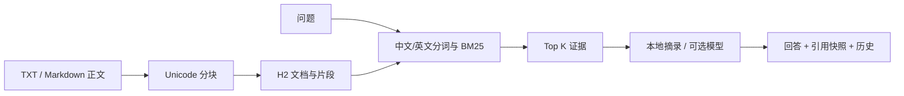

# NoteTrail RAG

### Local note search and answers with traceable sources

**Import text notes, find relevant Chinese or English passages with BM25, and review answers alongside their sources. Keep documents, citation snapshots, and question history across restarts.**

Default answers are offline extracts and need no model key. Model generation requires a configured compatible endpoint; vector search is not included.

**导入文本笔记，用 BM25 检索相关中英文片段，对照来源查看回答；文档、引用快照和问答历史在重启后仍然保留。**

默认使用**本地摘录回答**，无需模型密钥；配置兼容接口后才能调用真实模型生成。摘录模式不是大模型，也不宣称向量语义检索。

[Run locally / 本地运行](#运行) · [API](docs/api.md) · [Design / 设计说明](docs/design.md)

Windows 可双击根目录 `start.bat`：自动查找 Java 21+。服务就绪后自动打开浏览器；保持终端窗口打开，按 Ctrl+C 停止服务。再次双击会打开已运行的同名服务。缺少 JAR 时会提示先构建；启动失败保留错误信息。`start.bat -Check` 仅检查启动环境。

## 运行

源码构建需要 JDK 21+、Maven 3.8.5+：

```sh
mvn clean package
java -jar target/notetrail-rag.jar
```

打开 **http://127.0.0.1:18082**：

1. 点击“填入示例笔记”，再点击“导入并分块”。
2. 点击“仅查看检索证据”，观察原文、片段位置与 BM25 分数。
3. 点击“生成带出处的回答”，查看模式标签和对应引用。
4. 重启服务后，文档与问答历史仍然保留。

也可运行 PowerShell 的 `bin/start.ps1` 或 Linux/macOS 的 `sh bin/start.sh`。构建产生 `target/notetrail-rag-dist.zip`，解压后通过启动器运行，仅需 JDK 21。

## 核心链路



| 能力 | 实现 |
| --- | --- |
| 文档导入 | JSON 文本接口；页面可读取 UTF-8 TXT/Markdown |
| 文档分块 | 500 Unicode 码点，重叠 80，不切断代理对 |
| 检索 | 英文小写词、中文单字与双字；BM25，k1=1.2、b=0.75 |
| 引用 | 文档 ID、标题、片段 ID、位置、原文和分数 |
| 默认回答 | 按 [1]、[2] 摘录检索证据；无命中时说明资料不足 |
| 可选生成 | 兼容 chat/completions 的真实 HTTP 调用 |
| 历史 | 保存回答模式与当时引用快照，跨重启保留 |
| 删除 | 文档和块一起删除，不再参与检索，已有历史快照保留 |

首版面向少量学习笔记。检索时从 H2 读取片段并在进程内计算分数；没有向量数据库、重排序模型、PDF/OCR、后台导入队列、账户或组织隔离。

## API 示例

PowerShell：

```powershell
$base = 'http://127.0.0.1:18082'
$document = Get-Content examples/java-notes.json -Raw -Encoding UTF8
Invoke-RestMethod "$base/api/documents" -Method Post -ContentType 'application/json; charset=utf-8' -Body ([Text.Encoding]::UTF8.GetBytes($document))
$question = Get-Content examples/question.json -Raw -Encoding UTF8
Invoke-RestMethod "$base/api/questions" -Method Post -ContentType 'application/json; charset=utf-8' -Body ([Text.Encoding]::UTF8.GetBytes($question))
```

见 [API 文档](docs/api.md) 和 `examples/api.http`。单篇正文最多 100000 码点，问题最多 1000 字符，Top K 默认 5，范围 1–10。

## 启用真实模型

通过 shell 或 IDE 设置下列变量后重启：

| 变量 | 说明 |
| --- | --- |
| NOTETRAIL_AI_MODE | local（默认）或 openai |
| NOTETRAIL_AI_BASE_URL | 兼容服务的基础地址，通常以 /v1 结尾 |
| NOTETRAIL_AI_MODEL | 该服务支持的模型名称 |
| NOTETRAIL_AI_API_KEY | 通过环境变量提供的密钥，不写入仓库 |

请求发送到 `BASE_URL/chat/completions`，包含问题和检索证据。完整响应超时 15 秒，最大 256 KiB，不跟随重定向。配置缺失或供应商失败会明确报错，不会悄悄切换成摘录回答。没有检索命中时，不会调用模型。

回答中的 `mode` 为 `EXTRACTIVE` 或 `OPENAI_COMPATIBLE`，页面也明确显示。模型模式下，citations 是提供给模型的证据；它不等于对模型生成内容真实性的保证，重要内容仍需核对原文。

`.env.example` 不会自动加载。默认数据库 `jdbc:h2:file:./data/notetrail;DB_CLOSE_ON_EXIT=FALSE;WRITE_DELAY=0`，可用 `NOTETRAIL_DB_URL` 覆盖。默认监听 `127.0.0.1:18082`，可用 `SERVER_PORT` 调整端口。服务没有认证，保持本地使用。

## 构建与学习

默认文件数据库设置 `WRITE_DELAY=0`，关闭 H2 的提交写入延迟。自定义数据库 URL 时请保留该设置；这不等于对硬件故障或断电作保证。参见 [H2 WRITE_DELAY](https://h2database.com/html/commands.html#set_write_delay)。

```sh
mvn clean package
```

构建后可按上文启动服务，运行 `examples/api.http` 或 PowerShell API 示例。

- [设计说明](docs/design.md)
- [学习笔记](docs/learning-notes.md)
- [后端实现说明](docs/backend-report.md)

初始实现由 AI 编程助手协助完成。学习展示可以围绕分块取舍、检索质量、引用溯源和模型异常处理展开。后续适合增加有评测集支撑的 embedding 检索与混合召回，再比较质量与成本；这些尚未实现。

代码使用 [MIT](LICENSE)，运行时依赖保留各自许可，见 [THIRD_PARTY_NOTICES.md](THIRD_PARTY_NOTICES.md)。
